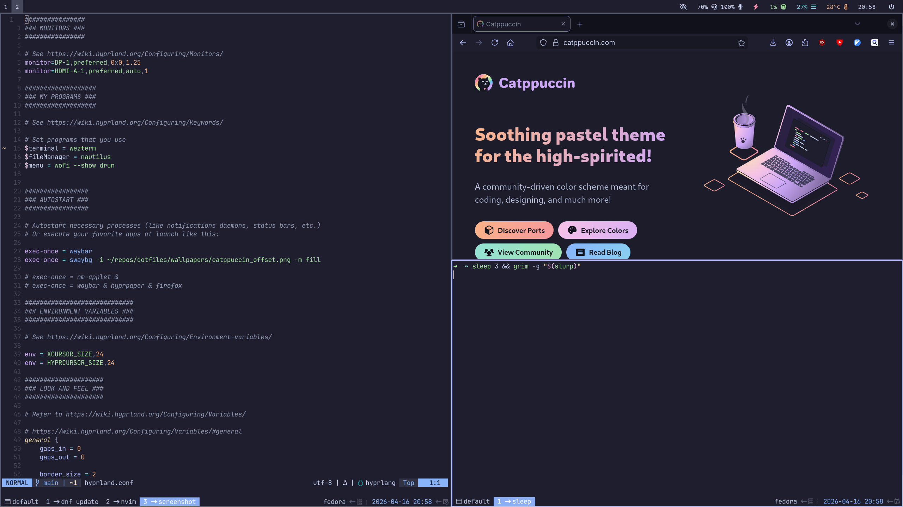
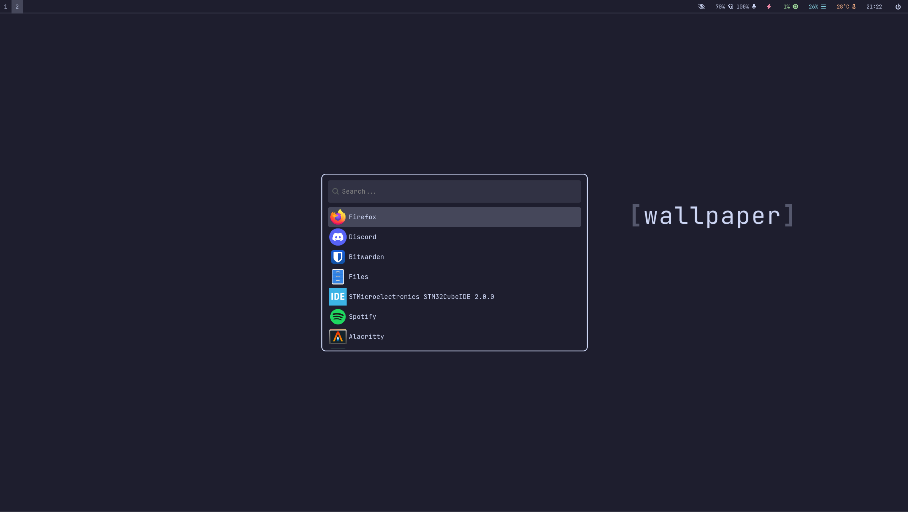

# Dotfiles

Minimal Hyprland and Neovim setup focused on keyboard-driven workflows and low visual noise.

## Philosophy

This setup is built around a keyboard-first workflow. Interactions are designed to avoid the mouse entirely.

Neovim is the core of the setup, primarily configured for C development (GDB, Neovim), but the configuration is extensible to any other language.

The overall design avoids visual distractions:

* no animations
* no transparency or blur effects
* no unnecessary UI elements
* no window gaps or ornamental spacing

The goal is to be fast, efficient, and free of bloat, even if that comes at the cost of aesthetics.

## Install script

`install.sh` will symlink all files from this repository into the corresponding locations in your home directory.

If a file already exists, the script will prompt before replacing it. When you choose to replace it, the existing file is moved to a timestamped backup directory at:

`~/dotfiles_backup/<timestamp>/`

This allows you to restore your previous configuration if needed.

**Disclaimer:**
This script modifies files in your home directory. Review it before running.

## Programs

Non-exhaustive list of configured applications:

### Core stack
* Neovim
* Hyprland
* WezTerm
* Zsh
* Waybar
* Wofi

### Tools
* GDB
* ClangFormat
* Vial

### Legacy
* Alacritty (replaced by WezTerm, no longer maintained)

## Vial disclaimer

I use a [split keyboard](https://home.ifkb.tech/products/if-ergolite), so the Vial setup is tuned for this specific layout. If you use any other keyboard, I recommend using this only as inspiration rather than copying it directly.

## Credits

[albinalm – thanks for the wallpaper](https://github.com/albinalm/)
